# kubevirt-manager


**Maintainers:** [feitnomore](https://github.com/feitnomore/)

Simple Angular Frontend and NodeJS + Express Backend to operate [Kubevirt](https://kubevirt.io/). This tools lets you perform basic operations around `Virtual Machines`, `Virtual Machine Instances`, and `Disks`. It was built based on requirements I had for my own environment.

*WARNING:* Use it at your own risk.

## INTRODUCTION

I've created this Frontend for `KubeVirt` while I was trying to learn a little bit of `Angular`. Basically this tool uses `kubectl proxy` to proxy API requests to `kubeapiserver`. To handle the `Disk`/`Volume` part, the tool works through [CDI](https://github.com/kubevirt/containerized-data-importer/).

## REQUIREMENTS

Kubevirt featureGate `ExpandDisks` is required.

CDI featureGate `HonorWaitForFirstConsumer` is required: 
```
  config:
    featureGates:
    - HonorWaitForFirstConsumer
```

StorageClass features `WaitForFirstConsumer` and `allowVolumeExpansion` are required:
```
volumeBindingMode: WaitForFirstConsumer
allowVolumeExpansion: true
```

## HOW TO INSTALL IT

### Create the Namespace
```sh
$ kubectl apply -f kubernetes/ns.yaml
```
### Create the Service Account and RBAC
```sh
$ kubectl apply -f kubernetes/rbac.yaml
```
### Create the FrontEnd Deployment
```sh
$ kubectl apply -f kubernetes/deployment.yaml
```
### Create the Priority Classes
```sh
$ kubectl apply -f kubernetes/pc.yaml
```
### Create the FrontEnd Service
```sh
kubectl apply -f kubernetes/service.yaml
```

## HOW TO USE IT

To use the tool, you can either use `kubectl port-forward` on port 8080, use a `Service` with type `NodePort` or `LoadBalancer`, or, create an `Ingress` for your service.  
*Note:* As the tool needs Websocket support, if you are using an `Ingress` make sure you set it up accordingly.

## Screenshot

Dashboard:</br>
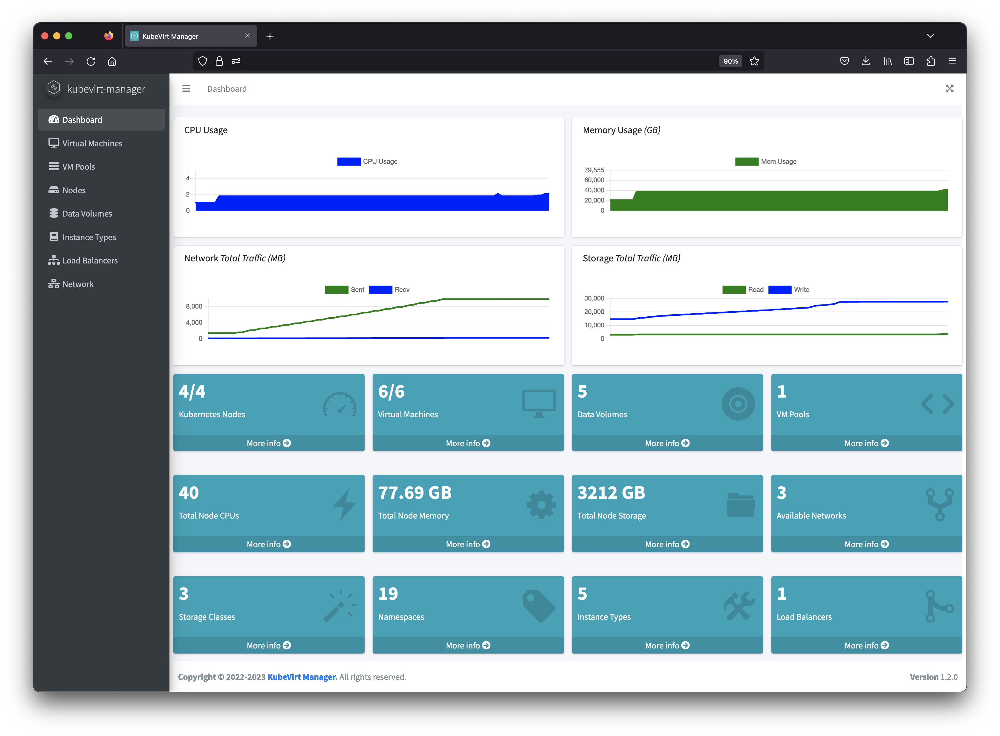
Instance List:</br>

</br>Instance Info & New Instance </br>
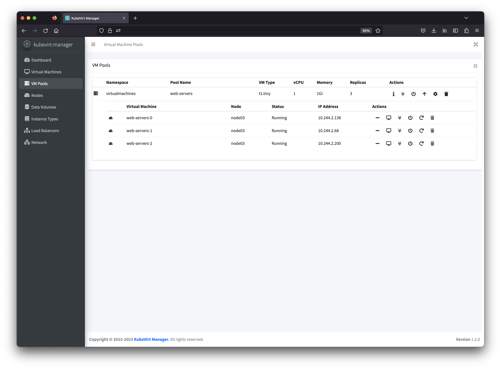
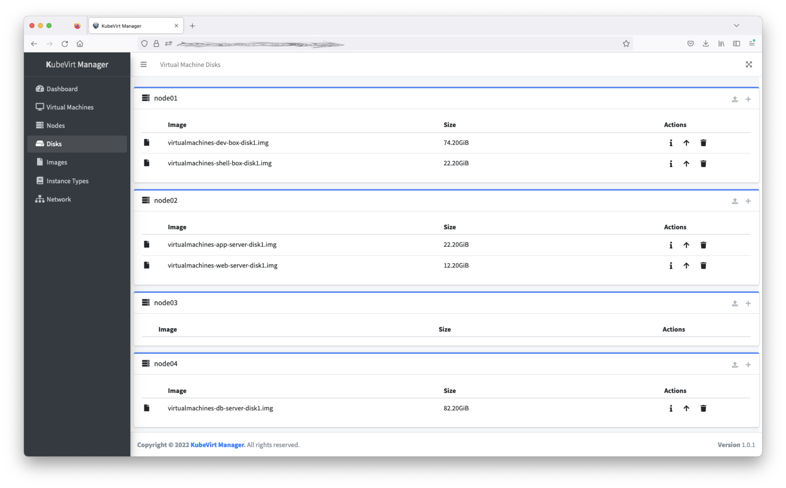
</br>Instance CPU/Memory & Priority Class </br>

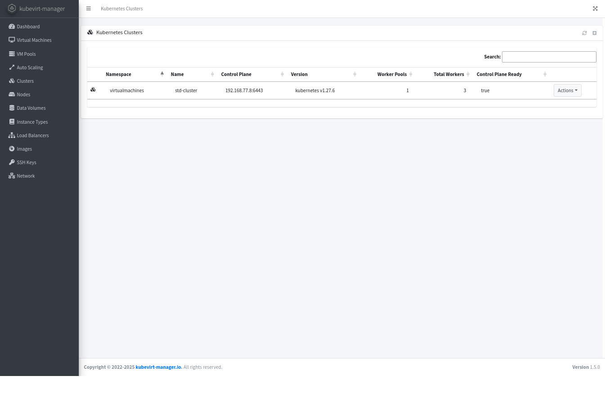
</br>Disk & Cloud Init:</br>
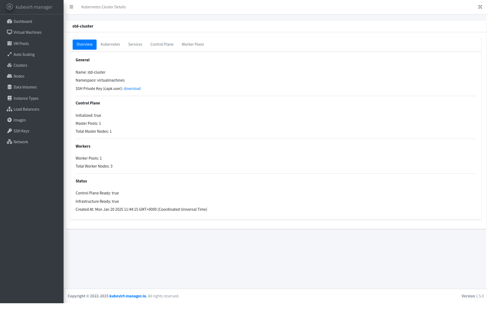
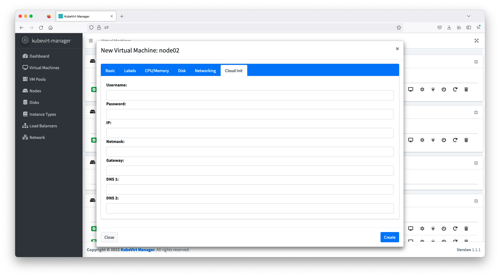
VM Pool:</br>
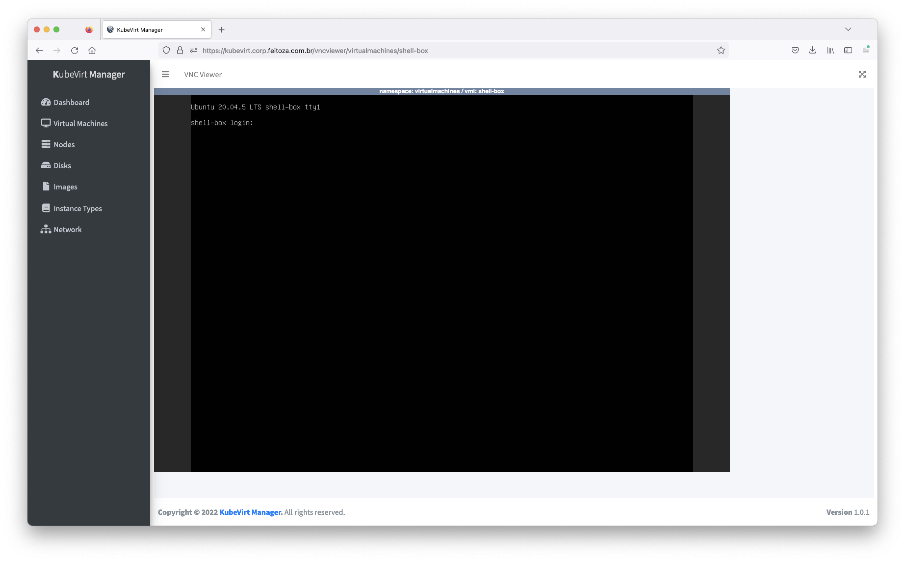
</br>Pool Info & New Pool </br>
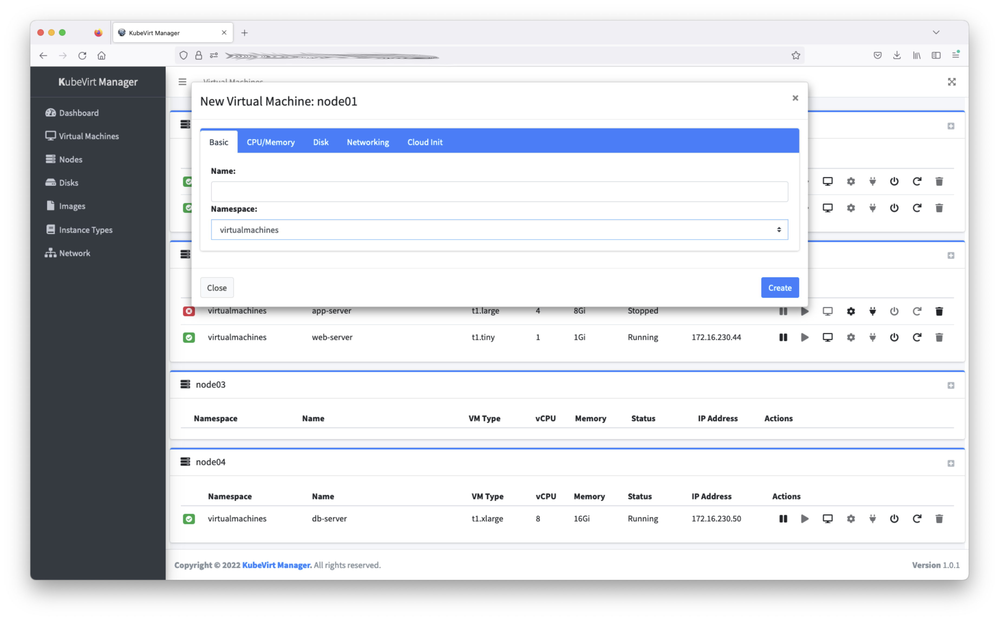
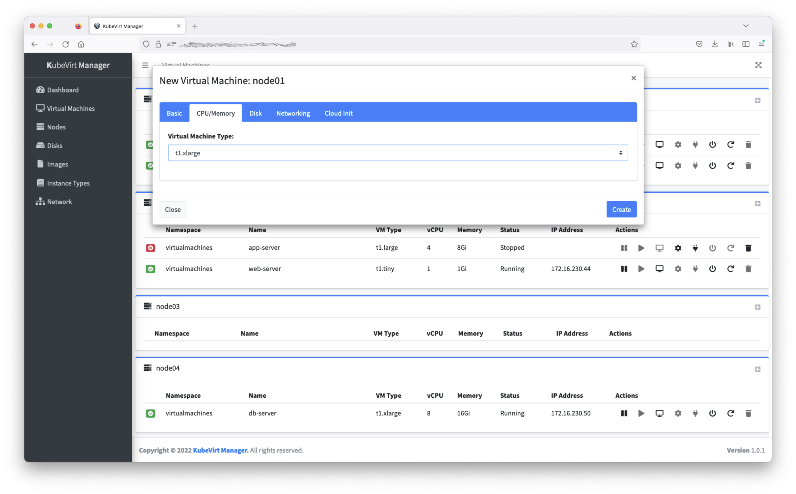
</br>Node & Data Volumes</br>
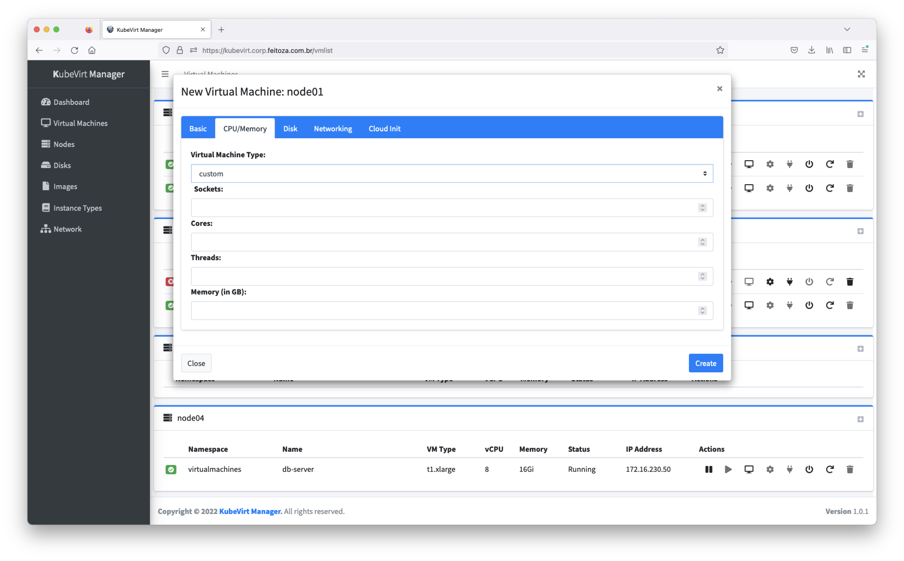
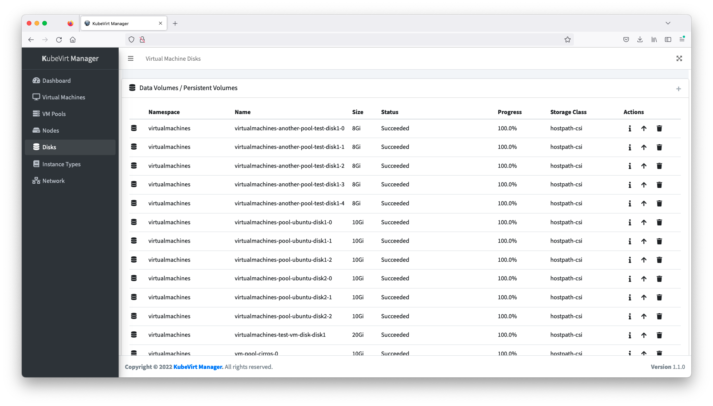
</br>Instance Type & Networking</br>

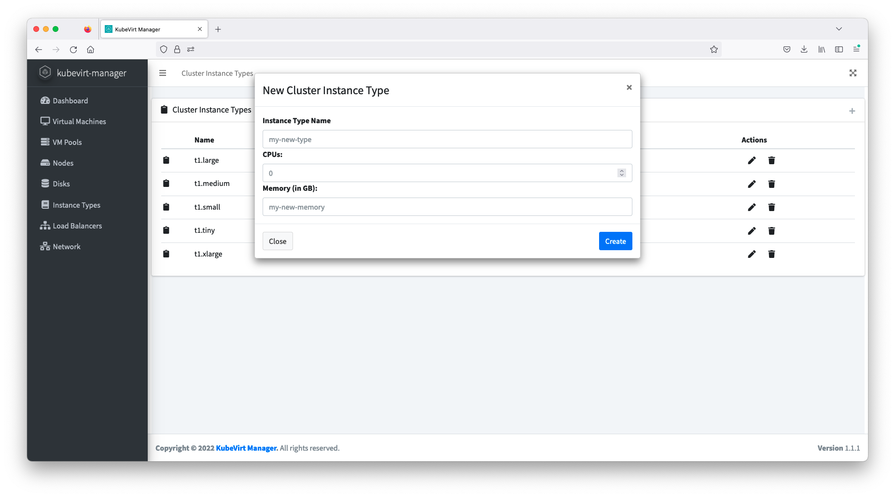
</br>VNC Screen</br>
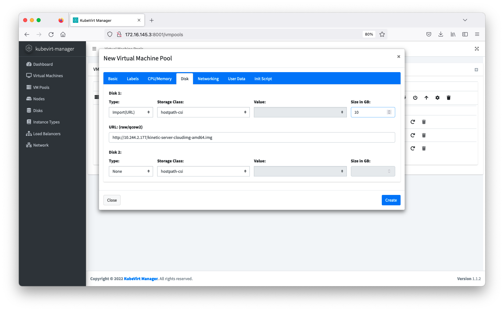

*Note:* Check `images` directory for more screenshots.

## Building

* Frontend 
```sh
docker build -t your-repo/kubevirt-manager:version .
docker push your-repo/kubevirt-manager:version
```

* Backend
```sh
cd node-backend/
docker build -t your-repo/kubevirt-manager-worker:version .
docker push your-repo/kubevirt-manager-worker:version
```

## References

1. [Kubernetes](https://kubernetes.io/)
2. [Kubectl](https://kubernetes.io/docs/reference/kubectl/kubectl/)
3. [CDI](https://github.com/kubevirt/containerized-data-importer/)
4. [Kubevirt](https://kubevirt.io)
5. [NodeJS](https://nodejs.org/en/)
6. [ExpressJS](https://expressjs.com/)
7. [Angular](https://angular.io/)
8. [AdminLTE](https://adminlte.io/)
9. [NoVNC](https://github.com/novnc/noVNC)

## License

**kubevirt-manager** is licensed under the [Apache Licence, Version 2.0](http://www.apache.org/licenses/LICENSE-2.0.html).
