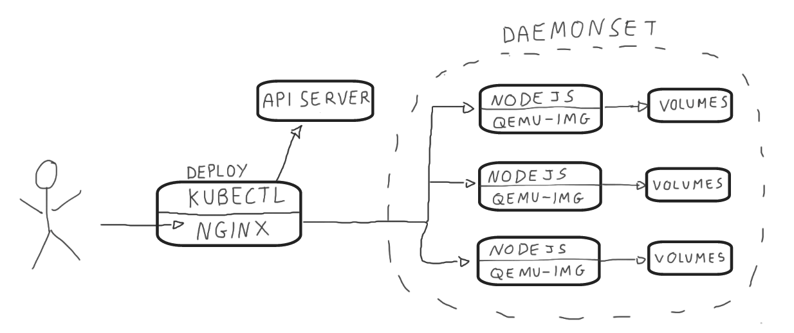
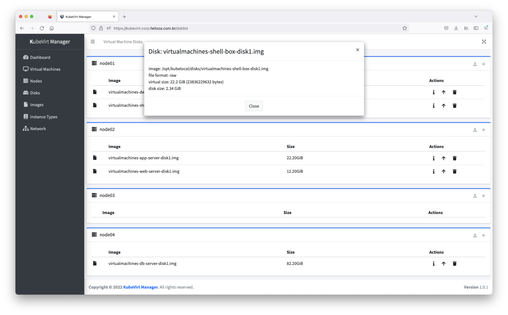
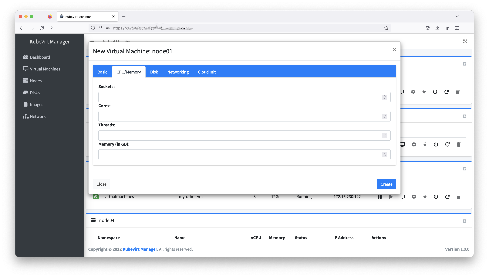

# kubevirt-manager


**Maintainers:** [feitnomore](https://github.com/feitnomore/)

Simple Angular Frontend and NodeJS + Express Backend to operate [Kubevirt](https://kubevirt.io/). This tools lets you perform basic operations around `Virtual Machines`, `Virtual Machine Instances`, and `Disks`. It was built based on requirements I had for my own environment.

*WARNING:* Use it at your own risk.

## INTRODUCTION

I've created this Frontend for `KubeVirt` while I was trying to learn a little bit of `Angular`. Basically this tool uses `kubectl proxy` to proxy API requests to `kubeapiserver`. For `Disks`, today I use `HostDisk` as backend for my `Disks`. To be able to work with these `Disks` a backend was developed in `NodeJS` and `ExpressJS` that uses `qemu-img` utility behind the scenes, to manage the `Images` and `Disks`. This `backend` runs as a `DaemonSet` on every node, to enable this tool to create `Images` and `Disks` on any node of the cluster.

## REQUIREMENTS

Kubevirt featureGate `ExpandDisks`.

CDI featureGate: 
```
  config:
    featureGates:
    - HonorWaitForFirstConsumer
```

StorageClass feature:
```
volumeBindingMode: WaitForFirstConsumer
allowVolumeExpansion: true
```

## HOW TO INSTALL IT

The installation is pretty straightforward. On every `Kubernetes Node` of the cluster, you need to create a directory to hold `Images` and a directory to hold `Disks`. Both directories should have `UID 10000 / GID 30000` as owner. After creating the directories, adjust `Volumes` and environment variables `DISKPATH` and `IMGPATH` on the `worker-daemonset.yaml` file.

### Create the Namespace
```sh
$ kubectl apply -f kubernetes/ns.yaml
```
### Create the Service Account and RBAC
```sh
$ kubectl apply -f kubernetes/rbac.yaml
```
### Create the FrontEnd Deployment
```sh
$ kubectl apply -f kubernetes/deployment.yaml
```
### Create the BackEnd DaemonSet
```sh
$ kubectl apply -f kubernetes/worker-daemonset.yaml
```
### Create the FrontEnd Service
```sh
kubectl apply -f kubernetes/service.yaml
```

## HOW TO USE IT

To use the tool, you can either use `kubectl port-forward` on port 8080, use a `Service` with type `NodePort` or `LoadBalancer`, or, create an `Ingress` for your service.  
*Note:* As the tool needs Websocket support, if you are using an `Ingress` make sure you set it up accordingly.

## Diagram



## Screenshot

Dashboard:</br>

Instance List:</br>

</br>Node and Networking:</br>


</br>Disk Information:</br>


</br>Image Information:</br>


</br>Instance Type:</br>


</br>VNC Screen:</br>


*Note:* Check `images` directory for more screenshots.

## Building

* Frontend 
```sh
docker build -t your-repo/kubevirt-manager:version .
docker push your-repo/kubevirt-manager:version
```

* Backend
```sh
cd node-backend/
docker build -t your-repo/kubevirt-manager-worker:version .
docker push your-repo/kubevirt-manager-worker:version
```

## References

1. [Kubernetes](https://kubernetes.io/)
2. [Kubectl](https://kubernetes.io/docs/reference/kubectl/kubectl/)
3. [Kubevirt](https://kubevirt.io)
4. [NodeJS](https://nodejs.org/en/)
5. [ExpressJS](https://expressjs.com/)
6. [Angular](https://angular.io/)
7. [AdminLTE](https://adminlte.io/)
8. [NoVNC](https://github.com/novnc/noVNC)
9. [QEMU](https://www.qemu.org/)

## License

**kubevirt-manager** is licensed under the [Apache Licence, Version 2.0](http://www.apache.org/licenses/LICENSE-2.0.html).
