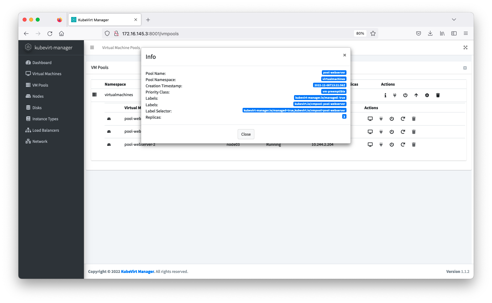
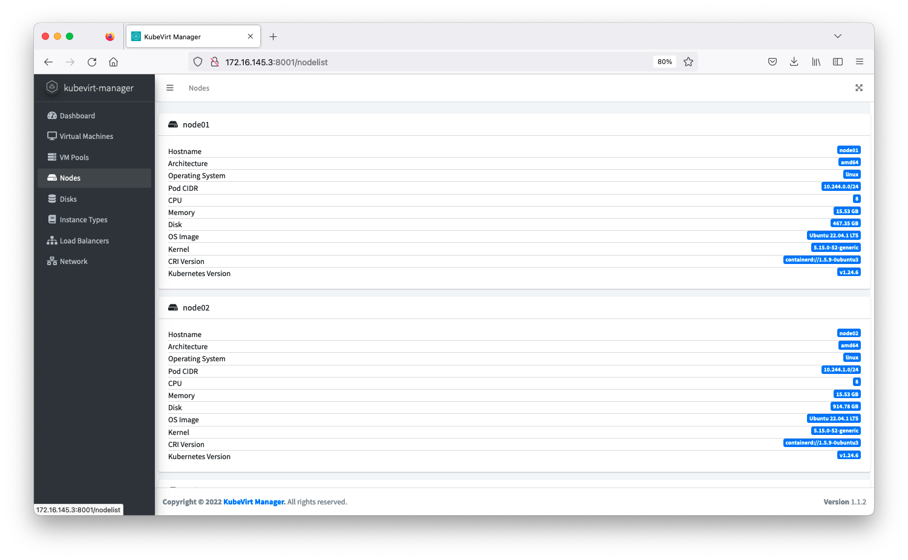
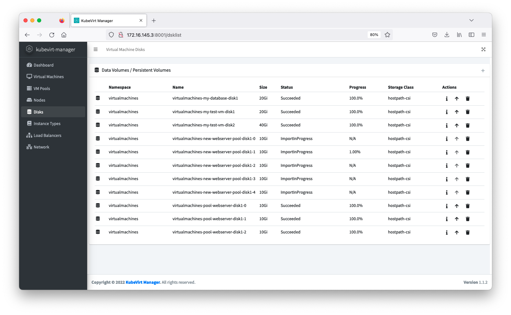
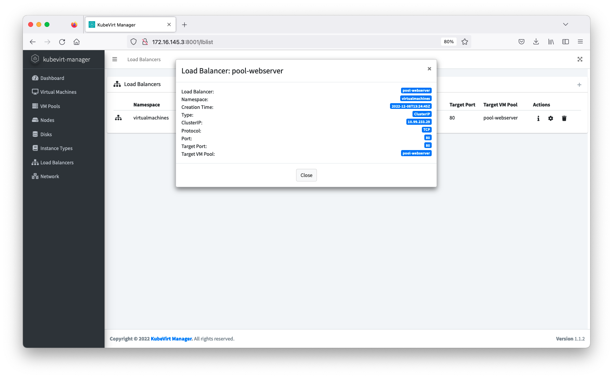
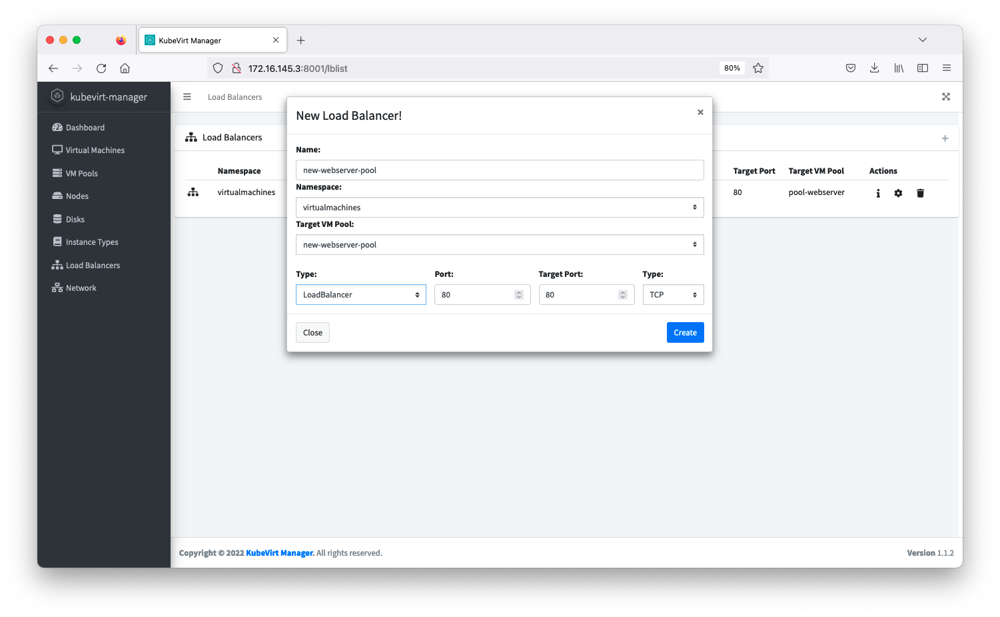
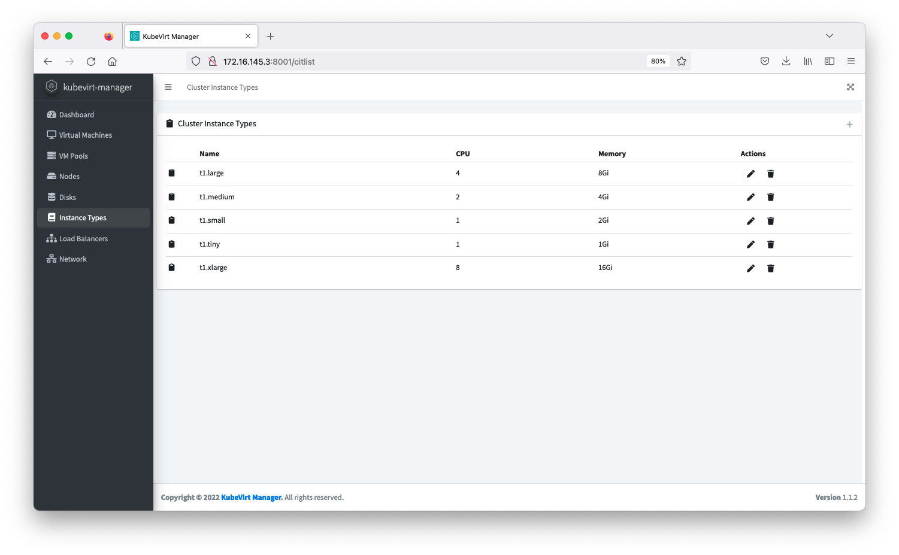
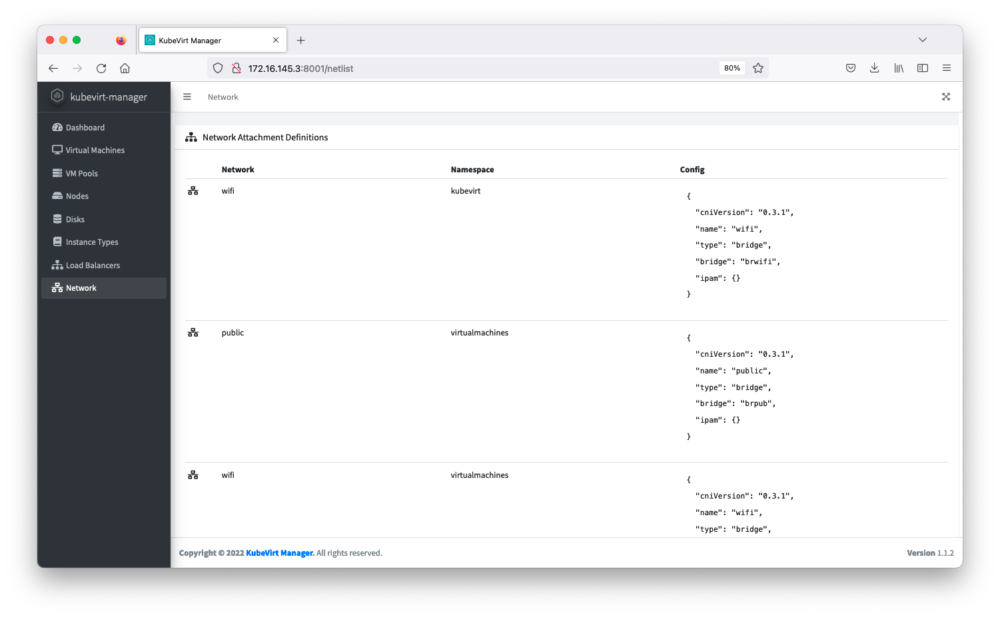
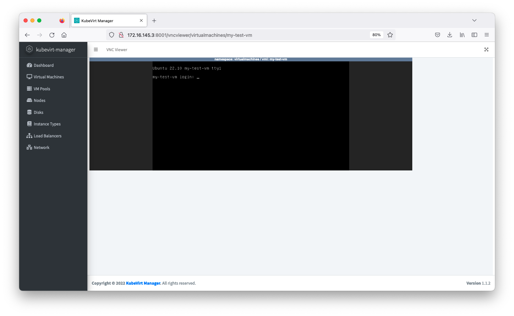

# kubevirt-manager


**Maintainers:** [feitnomore](https://github.com/feitnomore/)

Simple Angular Frontend Web UI Interface to operate [Kubevirt](https://kubevirt.io/). This tools lets you perform basic operations around `Virtual Machines`, `Virtual Machine Instances`, and `Disks`. It was built based on requirements I had for my own environment.

*WARNING:* Use it at your own risk.

## INTRODUCTION

I've created this Frontend for `KubeVirt` while I was trying to learn a little bit of `Angular`. Basically this tool uses `kubectl proxy` to proxy API requests to `kubeapiserver`. To handle the `Disk`/`Volume` part, the tool works through [CDI](https://github.com/kubevirt/containerized-data-importer/).

## REQUIREMENTS

Kubevirt featureGate `ExpandDisks` is required.

CDI is required with featureGate `HonorWaitForFirstConsumer` active: 
```
  config:
    featureGates:
    - HonorWaitForFirstConsumer
```

StorageClass features `WaitForFirstConsumer` and `allowVolumeExpansion` are required:
```
volumeBindingMode: WaitForFirstConsumer
allowVolumeExpansion: true
```

## HOW TO INSTALL IT

### Create the Namespace
```sh
$ kubectl apply -f kubernetes/ns.yaml
```
### Create the Service Account and RBAC
```sh
$ kubectl apply -f kubernetes/rbac.yaml
```
### Create the FrontEnd Deployment
```sh
$ kubectl apply -f kubernetes/deployment.yaml
```
### Create the Priority Classes
```sh
$ kubectl apply -f kubernetes/pc.yaml
```
### Create the FrontEnd Service
```sh
kubectl apply -f kubernetes/service.yaml
```

## PROMETHEUS INTEGRATION

To integrate `kubevirt-manager` with `prometheus`, you need to edit `kubernetes/prometheus-config.yaml` and adjust your endpoint on line 21.
After adjusting the endpoint, apply the configmap:
```sh
$ kubectl apply -f kubernetes/prometheus-config.yaml
```

This integration was tested using `prometheus-operator`. A `ServiceMonitor` descriptor to integrate `KubeVirt` with `prometheus-operator` has been provided as an example at `kubernetes/servicemonitor.yaml`.

*Note:* The tool assumes Prometheus is exposing the following metrics: kubevirt_vmi_storage_write_traffic_bytes_total, kubevirt_vmi_storage_read_traffic_bytes_total, kubevirt_vmi_network_transmit_bytes_total, kubevirt_vmi_network_receive_bytes_total, kube_pod_container_resource_requests and kubevirt_vmi_memory_domain_total_bytes. These metrics are exposed by `KubeVirt` and `kube-state-metrics`. 

## HOW TO USE IT

To use the tool, you can either use `kubectl port-forward` on port 8080, use a `Service` with type `NodePort` or `LoadBalancer`, or, create an `Ingress` for your service.  
*Note:* As the tool needs Websocket support, if you are using an `Ingress` make sure you set it up accordingly.

## Screenshot

Dashboard:</br>

Instance List:</br>

</br>Instance Info & New Instance </br>


</br>Instance CPU/Memory & Priority Class </br>


</br>Disk & Cloud Init:</br>


</br>VM Pool:</br>

</br>Pool Info & New Pool </br>


</br>Node & Data Volumes</br>


</br>Load Balancers:</br>

</br>Load Balancer Info & New Load Balancer</br>


</br>Instance Type & Networking</br>


</br>VNC Screen</br>


*Note:* Check `images` directory for more screenshots.

## Building

To build the tool simply run: 
```sh
docker build -t your-repo/kubevirt-manager:version .
docker push your-repo/kubevirt-manager:version
```

## Building & Running Locally
To build the tool run:
```sh
npm install
ng build
```
To run the tool:
```sh
kubectl proxy --www=./dist/kubevirtmgr-webui/ --accept-hosts=^.*$ --address=[::] --api-prefix=/k8s/ --www-prefix=
```
Access the tool at: http://localhost:8001/

*Note:* Make sure your `kubectl` is pointing to the right cluster.   
*Note:* Make sure the account your `kubectl` is using has correct RBAC.  
*Note:* This method doesn't support `Prometheus` integration.   

## References

01. [Kubernetes](https://kubernetes.io/)
02. [Kubectl](https://kubernetes.io/docs/reference/kubectl/kubectl/)
03. [CDI](https://github.com/kubevirt/containerized-data-importer/)
04. [Kubevirt](https://kubevirt.io)
05. [NodeJS](https://nodejs.org/en/)
06. [Angular](https://angular.io/)
07. [AdminLTE](https://adminlte.io/)
08. [NoVNC](https://github.com/novnc/noVNC)
09. [Prometheus Operator](https://github.com/prometheus-operator/prometheus-operator)
10. [kube-state-metrics](https://github.com/kubernetes/kube-state-metrics)

## License

**kubevirt-manager** is licensed under the [Apache Licence, Version 2.0](http://www.apache.org/licenses/LICENSE-2.0.html).
